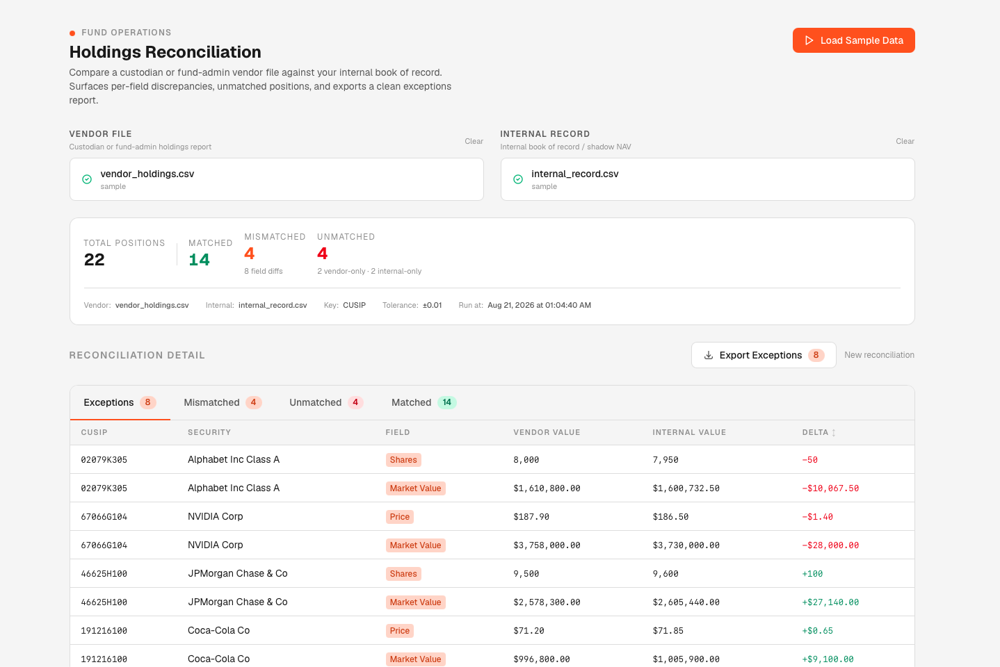

# ETF Holdings Reconciliation Tool

A client-side tool for reconciling custodian/fund-admin vendor holdings files against an internal book of record. Built as a demonstration of ETF fund-operations tooling patterns.

**[Live demo →](https://etf-reconciliation-tool.vercel.app)**



---

## What it does

ETF fund administrators receive daily holdings files from custodians and pricing vendors. Reconciling those files against the internal book of record is one of the most common and error-prone tasks in fund ops — typically done by hand in Excel. This tool automates that comparison.

Given two CSV files (vendor and internal), it:

1. **Matches** rows on a configurable key column (auto-detects CUSIP, ISIN, Ticker)
2. **Classifies** every position into one of three buckets:
   - **Matched** — both files agree on all compared fields (within a numeric tolerance)
   - **Mismatched** — key exists in both files but one or more values differ; shows per-field delta
   - **Unmatched** — key exists in only one file; flagged by which side it's missing from
3. **Surfaces exceptions** in a sortable table — mismatches sorted by delta magnitude by default
4. **Exports** a clean exceptions CSV for escalation or audit trail

---

## Sample data

Click **Load Sample Data** to run an instant demo. The bundled files simulate a 20-position ETF holdings reconciliation with deliberate discrepancies:

| Type | Positions | Detail |
|---|---|---|
| Matched | 14 | All fields agree across both files |
| Mismatched | 4 | GOOGL (shares), NVDA (price), JPM (shares), KO (price) |
| Unmatched | 4 | BRK.B + BMY vendor-only · ABT + HD internal-only |

---

## Tech

- **Next.js 16** (App Router) + TypeScript
- **Tailwind CSS v4** — data-dense ops-tool aesthetic
- **Papaparse** — client-side CSV parsing
- No backend, no auth, no persistence — everything runs in the browser

---

## Running locally

```bash
npm install
npm run dev
```

Open [http://localhost:3000](http://localhost:3000).

---

## Design decisions worth noting

**Numeric tolerance.** Floating-point representation means two files can report the same value with a sub-cent difference. The reconciler treats numeric diffs ≤ $0.01 as matched to avoid false positives.

**Currency formatting heuristic.** Values are formatted as USD only if they carry an explicit `$` prefix or have exactly 2 decimal places (market values, prices). Bare integers like share counts render as plain numbers — `8,000` not `$8,000.00`.

**Key column auto-detection.** On file upload, the tool scans headers for CUSIP → ISIN → Ticker → ID in that order and pre-selects the best match. The user can override via dropdown.

**Error handling.** The tool validates both files before reconciling: checks for data rows, verifies the key column exists in both files, and confirms there are shared comparison columns — each with an actionable error message.

---

## Production architecture note

This is a client-side demo scoped for shareability. At ETF-issuer scale, this pattern would look different:

- An ingestion service (Python or Go) pulling vendor files from SFTP on a schedule
- Normalized rows written to Postgres with provenance tracking (filename, ingestion timestamp, checksum)
- Reconciliation running as a queued job (SQS + Lambda or a Celery worker) rather than in the browser
- Exceptions surfaced through a persistent review queue with full audit trail — who resolved each exception, when, and what the resolution was
- Retry logic, dead-letter queues, and alerting for failed ingestions
